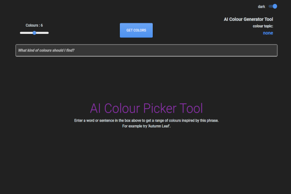

# AI Colour Generator / Picker Tool

## Description

An OpenAI powered colour picking utility built using Vite, React and TypeScript.

The App constructs a suitable prompt using the users input that then returns a JSON object with the requested colour information.

Results can be copied to local clipboard as JSON data and pasted into a code editor for use.

### NOTE: This is a demo project only. Never put Open AI API keys inside a production frontend client application. Instead create a backend API to contact Open AI and relay the response back to the client app using any required authorisation method

  

## Set-up

Clone the project and install all dependencies using npm install.

Create an Open API API key from your Open API account.

Copy the example.env file to .env in the project root and paste the API key value in.

From the command line run  

```
 npm run dev
```

This will start up up the VITE dev server and serve the app from localhost:5173

## Using


https://github.com/piyook/ai-colour-picker/assets/51154763/c15d8b56-628c-4ccd-82c2-f4805a48b118


Enter a word or phrase to send to OpenAI to generate the desired number of colours. Press 'enter' or click the submit button to send a request.

The OpenAI API response is streamed and the colours updated as they are received by the app in real time. This method was chosen over waiting for a full response to complete before dispaying the colours produced. This was due to the length of the response times - especially for a larger number of colours, and the lack of feedback to a user.

Change the number of colours generated using the slider to change the value from 1 to 20. Note the larger the number of colours the longer the response time.  

The loader screen will appear whilst waiting for a response from OpenAI (this can take some time) and the colour pallete will be produced once a response is received.

Colours can be copied as JSON data to the clipboard to be pasted in a code editor or other software.

## TO DO

- Add option to connect to local dockerized Node.js backend service to contact Open AI and remove need for OpenAI API key in the App. See <https://github.com/piyook/open-ai-backend>
